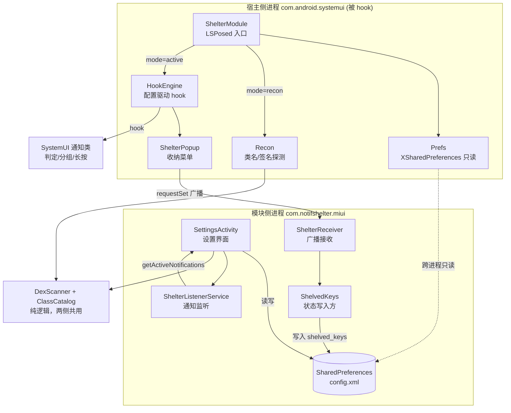
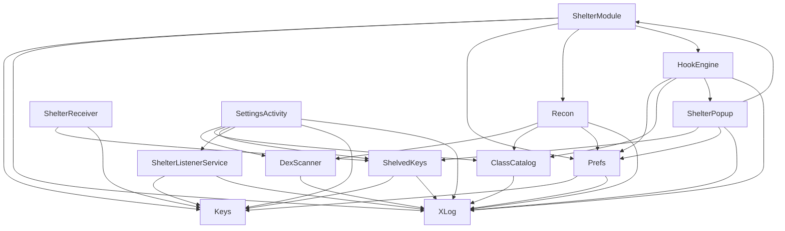

# 通知收纳 · Code Wiki

> HyperOS / MIUI SystemUI 通知收纳 LSPosed 模块的完整代码文档。
> 覆盖：整体架构、模块职责、关键类与函数、依赖关系、运行方式。

---

## 目录

- [1. 项目概览](#1-项目概览)
- [2. 整体架构](#2-整体架构)
- [3. 目录结构](#3-目录结构)
- [4. 构建与依赖关系](#4-构建与依赖关系)
- [5. 模块职责与关键类](#5-模块职责与关键类)
- [6. 数据模型与配置格式](#6-数据模型与配置格式)
- [7. 运行方式](#7-运行方式)
- [8. 设计取舍](#8-设计取舍)
- [9. 扩展点](#9-扩展点)
- [10. 预留与未使用项](#10-预留与未使用项)
- [11. 排查索引](#11-排查索引)

---

## 1. 项目概览

**通知收纳**是一个 **LSPosed / Xposed 模块**。它 hook 小米 SystemUI，让用户可以**手动把任意通知折叠进「不常用通知」区**。

面向系统：HyperOS 4 / Android 17；同时兼容 HyperOS 1/2、MIUI 14+（需按流程重新定位一次类名）。

### 1.1 能力边界

| 能力 | 状态 |
|---|---|
| 编译出可被 LSPosed 识别的模块 APK | ✅ 已完成并验证 |
| 枚举本机 SystemUI 的全部类名（无需 root） | ✅ 开箱即用 |
| 在 SystemUI 进程内反射出任意类的完整方法签名 | ✅ 开箱即用 |
| 应用内列出当前通知、手动选择收纳、状态持久化 | ✅ 开箱即用 |
| 长按通知弹出自带「收纳」菜单（独立 overlay） | ✅ 定位到长按入口后可用 |
| 收纳后真正折叠进「不常用通知」区 | ⚠️ 需先在真机上探测判定点，填一行 JSON 配置 |

核心原因：MIUI 的 SystemUI 是 AOSP 深度魔改，混淆程度、类名、方法签名每个大版本都变，无法硬编码。因此工程被设计为**两阶段工具**（探测 → 配置），换机型/版本时只改 JSON，不改代码、不重新编译。

### 1.2 技术栈

| 项 | 值 |
|---|---|
| 语言 | Java 17 |
| 构建 | Gradle + AGP 8.13.2 |
| compileSdk / minSdk / targetSdk | 36 / 29 / 36 |
| 唯一编译期依赖 | `de.robv.android.xposed:api:82`（`compileOnly`，运行时由框架提供） |
| 命名空间 | `com.notifshelter.miui` |

---

## 2. 整体架构

### 2.1 双进程模型

本模块的代码运行在**两个完全不同的进程**里，这是理解全部代码的前提：

| 视角 | 进程 | 代码 | 职责 |
|---|---|---|---|
| **宿主侧（SystemUI 侧）** | `com.android.systemui` | [ShelterModule.java](file:///workspace/app/src/main/java/com/notifshelter/miui/ShelterModule.java)、[HookEngine.java](file:///workspace/app/src/main/java/com/notifshelter/miui/HookEngine.java)、[Recon.java](file:///workspace/app/src/main/java/com/notifshelter/miui/Recon.java)、[Prefs.java](file:///workspace/app/src/main/java/com/notifshelter/miui/Prefs.java)、[ShelterPopup.java](file:///workspace/app/src/main/java/com/notifshelter/miui/ShelterPopup.java) | 被 LSPosed 注入，读配置、注入 hook、探测签名、弹收纳菜单 |
| **模块侧（应用进程）** | `com.notifshelter.miui` | [SettingsActivity.java](file:///workspace/app/src/main/java/com/notifshelter/miui/SettingsActivity.java)、[ShelterListenerService.java](file:///workspace/app/src/main/java/com/notifshelter/miui/ShelterListenerService.java)、[ShelterReceiver.java](file:///workspace/app/src/main/java/com/notifshelter/miui/ShelterReceiver.java)、[ShelvedKeys.java](file:///workspace/app/src/main/java/com/notifshelter/miui/ShelvedKeys.java) | 提供 UI、枚举当前通知、**独占写入**收纳状态 |

两个进程通过两条通道通信：

1. **SharedPreferences（模块侧写 → 宿主侧读）**：依赖 Manifest 的 `xposedsharedprefs=true`，LSPosed 把模块的 `config.xml` 设为被 hook 进程可读，宿主侧用 `XSharedPreferences` 跨进程读取，无需 root。
2. **广播（宿主侧发 → 模块侧收）**：宿主侧需要改收纳状态时不能直接写对方 SharedPreferences（不同 UID，Android 10+ 不可靠），改为发广播回传，由应用侧落盘。

### 2.2 架构图



### 2.3 核心数据流

**A. 状态写入（用户点「收纳」）**

```
用户操作（应用内按钮 或 SystemUI 长按菜单）
  → ShelvedKeys.set()/toggle()/clear()  [应用侧直接写]
  或 ShelterPopup.applyState()
       → ShelvedKeys.requestSet() 发 ACTION_TOGGLE 广播
       → ShelterReceiver.onReceive() → ShelvedKeys.set()  [应用侧落盘]
  → config.xml 的 shelved_keys 更新
  → 宿主侧 Prefs.shelvedKeys(force=true) 重新读取（带节流缓存）
```

**B. 折叠生效（hook 命中）**

```
SystemUI 渲染通知 → 调用被 hook 的判定方法
  → HookEngine 的 before/after 回调
  → resolveKey() 取出该通知的 key
  → prefs.isShelved(key) 命中已收纳列表
  → 强制返回值（hook_bool）或改写字段（hook_field）
  → 判定方法返回「折叠」，通知进入不常用区
```

**C. 探测流程（适配新机型）**

```
应用内扫描（SettingsActivity.doScan）
  → DexScanner.scanFile(SystemUI.apk) 字节扫 DEX 得类名
  → ClassCatalog.bucket() 按 6 组关键词归类
  → 写入 recon_targets，切「探测模式」，重启 SystemUI
SystemUI 侧（Recon.schedule → 12s 后 run）
  → 再扫一遍 DEX + scanClassLoader
  → ClassCatalog.dumpMethods() 反射 dump 目标类方法签名
  → 输出到 logcat 与报告文件（3 个候选路径）
人工判断 → 填 hook JSON → 切「收纳模式」
```

### 2.4 两阶段工作流


---

## 3. 目录结构

```
/workspace
├─ app/
│  ├─ build.gradle.kts                     # 模块构建配置（compileSdk 36、debug 签名、lint 关闭）
│  └─ src/main/
│     ├─ AndroidManifest.xml               # xposed 元数据 + 组件声明
│     ├─ assets/xposed_init                # 入口类名（单行）
│     ├─ res/values/{arrays,strings,themes}.xml
│     ├─ res/drawable/ic_launcher.xml
│     └─ java/com/notifshelter/miui/       # 13 个 Java 源文件
├─ dist/notif-shelter-v0.1.0-debug.apk     # 已构建产物
├─ keystore/debug.keystore                 # 本地构建用调试签名
├─ build.gradle.kts                        # 根构建脚本（声明 AGP 版本）
├─ settings.gradle.kts                     # 仓库源 + 模块包含
├─ gradle.properties                       # JVM/构建开关（注意 useAndroidX=false）
├─ .gitignore
└─ README.md                               # 面向使用者的操作手册
```

### 源文件清单（`app/src/main/java/com/notifshelter/miui/`）

| 文件 | 运行进程 | 一句话职责 |
|---|---|---|
| [ShelterModule.java](file:///workspace/app/src/main/java/com/notifshelter/miui/ShelterModule.java) | 宿主侧 | LSPosed 入口，按模式分流 |
| [Keys.java](file:///workspace/app/src/main/java/com/notifshelter/miui/Keys.java) | 两侧 | 共享常量（pref 键、广播 action、包名） |
| [XLog.java](file:///workspace/app/src/main/java/com/notifshelter/miui/XLog.java) | 两侧 | 统一日志出口（logcat + 框架日志 + 报告文件） |
| [Prefs.java](file:///workspace/app/src/main/java/com/notifshelter/miui/Prefs.java) | 宿主侧 | 跨进程只读配置（带节流缓存） |
| [DexScanner.java](file:///workspace/app/src/main/java/com/notifshelter/miui/DexScanner.java) | 两侧 | 字节扫 DEX 枚举类名 |
| [ClassCatalog.java](file:///workspace/app/src/main/java/com/notifshelter/miui/ClassCatalog.java) | 两侧 | 类名分组筛选 + 方法签名格式化 |
| [Recon.java](file:///workspace/app/src/main/java/com/notifshelter/miui/Recon.java) | 宿主侧 | 探测编排 + 报告输出 |
| [HookEngine.java](file:///workspace/app/src/main/java/com/notifshelter/miui/HookEngine.java) | 宿主侧 | 配置驱动的三种 hook 策略 |
| [ShelterPopup.java](file:///workspace/app/src/main/java/com/notifshelter/miui/ShelterPopup.java) | 宿主侧 | 长按后的收纳 overlay 菜单 |
| [ShelvedKeys.java](file:///workspace/app/src/main/java/com/notifshelter/miui/ShelvedKeys.java) | 两侧 | 收纳状态唯一写入方 + 广播回传 |
| [ShelterListenerService.java](file:///workspace/app/src/main/java/com/notifshelter/miui/ShelterListenerService.java) | 模块侧 | 拿当前通知列表（通知监听服务） |
| [ShelterReceiver.java](file:///workspace/app/src/main/java/com/notifshelter/miui/ShelterReceiver.java) | 模块侧 | 接收宿主侧收纳/存活广播 |
| [SettingsActivity.java](file:///workspace/app/src/main/java/com/notifshelter/miui/SettingsActivity.java) | 模块侧 | 设置界面（模式/通知/扫描/hook 配置） |

---

## 4. 构建与依赖关系

### 4.1 构建配置

**[settings.gradle.kts](file:///workspace/settings.gradle.kts)**
- 仓库：`google()`、`mavenCentral()`、`https://api.xposed.info/`（Xposed API）。
- `RepositoriesMode.FAIL_ON_PROJECT_REPOS`：仓库只在 settings 里声明，模块脚本不得再声明。
- 根项目名 `MiuiNotifShelter`，包含 `:app`。

**[build.gradle.kts](file:///workspace/build.gradle.kts)**：仅声明 `com.android.application` 版本 `8.13.2`（`apply false`）。

**[app/build.gradle.kts](file:///workspace/app/build.gradle.kts)** 关键点：
- `namespace = "com.notifshelter.miui"`。
- `compileSdk = 36`：Android 17 的平台包在 SDK 里叫 `android-37.0`（minor 版本命名），只有 AGP 9.x 认；本模块所有 hook 都走反射，编译期用不到高版本 API，用 36 编译、在 17 上运行无碍。
- `minSdk = 29`（Android 10，对应不同 UID 不能互写 SharedPreferences 的下限）。
- `signingConfigs.projectDebug`：显式指定 `keystore/debug.keystore`，避免 AGP 自动创建 debug keystore（容器/CI 里可能因 JDK 探测 cgroup 信息而 NPE）。
- `debug` 与 `release` 都用该调试签名（本地验证方便；正式发布需换签名）。
- `lint { abortOnError=false; checkReleaseBuilds=false }`：关闭 release 的 lintVital，避免容器环境崩溃。
- 依赖：`compileOnly("de.robv.android.xposed:api:82")`。

**[gradle.properties](file:///workspace/gradle.properties)**：`useAndroidX=false`（本模块不用 AndroidX）、`parallel=true`、`caching=true`、`nonTransitiveRClass=true`。

### 4.2 依赖关系

**编译期依赖**
- `de.robv.android.xposed:api:82`（`compileOnly`）：提供 `IXposedHookLoadPackage`、`IXposedHookZygoteInit`、`XC_MethodHook`、`XposedBridge`、`XposedHelpers`、`XSharedPreferences`、`XC_LoadPackage`。运行时由 LSPosed 框架注入，**不会打进 APK**。
- Android framework（隐式）：`AndroidAppHelper`、`NotificationListenerService`、`StatusBarNotification`、标准 UI 组件。

**运行时依赖**
- LSPosed 框架在 SystemUI 进程启动时调用入口（见 `assets/xposed_init`）。
- Manifest 元数据启用三项关键能力：`xposedmodule`/`xposedminversion=93`、`xposedscope`（默认只勾 SystemUI）、`xposedsharedprefs`（跨进程读配置）。

**类依赖图**



依赖方向清晰：`Keys`/`XLog` 是零依赖底座；`Prefs`、`DexScanner`、`ClassCatalog` 是能力原子；`Recon`、`HookEngine` 是编排层；`ShelterModule` 是总入口。**只有宿主侧能够触达 hook/探测能力**，模块侧只能做 UI 与状态。

---

## 5. 模块职责与关键类

### 5.1 宿主入口层

#### `ShelterModule` — LSPosed 入口

实现 `IXposedHookLoadPackage` 与 `IXposedHookZygoteInit`。静态持有 `sPrefs`，供宿主侧其他类通过 `ShelterModule.prefs()` 读取配置。

| 方法 | 说明 |
|---|---|
| `initZygote(StartupParam)` | Zygote 初始化时打日志「模块已加载」，打印 `modulePath`。 |
| `handleLoadPackage(XC_LoadPackage.LoadPackageParam)` | 主分流逻辑；**整个方法体包在 try/catch 里**，绝不把异常抛回 SystemUI（否则状态栏会崩溃/重启）。 |
| `prefs()`（静态） | 返回宿主侧配置单例。 |
| `announceLater(String mode)` | 延迟 6 秒通过主线程 Handler 发 `ACTION_HELLO` 存活广播（此时 `AndroidAppHelper.currentApplication()` 才可用）。 |

**分流规则**（[ShelterModule.java](file:///workspace/app/src/main/java/com/notifshelter/miui/ShelterModule.java#L38-L76)）：
1. 包名不是 `com.android.systemui` → 直接返回。
2. 创建 `Prefs`，设置日志 verbose。
3. `prefs.available()==false`（读不到配置）→ 告警并返回（必须先打开一次应用生成 `config.xml`）。
4. 无论何种模式都 `announceLater(mode)`。
5. `mode == off` → 不注入任何 hook。
6. `mode == recon` → `Recon.schedule(...)`。
7. 其余（`active`）→ `new HookEngine(prefs).applyAll(...)`。

#### `Keys` — 共享常量

纯常量类（私有构造），集中定义 pres 文件名 `config`、运行模式、探测键、hook 键、收纳键、跨进程 action。两侧进程必须保持一致。详见 [第 6 节](#6-数据模型与配置格式)。

#### `XLog` — 统一日志出口

| 方法 | 说明 |
|---|---|
| `i/v/w/e(...)` | 分级日志；`v` 受 `sVerbose` 开关控制。 |
| `describe(Throwable)` | 统一格式化异常为 `类名: message`。 |
| `openReport(File)` / `closeReport()` | 打开/关闭报告文件，之后所有日志同步写入。 |
| `lineCount()` | 已输出行数（报告结尾统计）。 |
| `setVerbose(boolean)` | 由入口根据配置设置。 |

输出同时走三处：`Log.println`（tag `MIUI-Shelter`）、`XposedBridge.log`（仅 WARN 及以上，且非 Xposed 环境下静默）、报告文件（若已打开）。设计上所有写入失败都被吞掉，**日志失败不影响主流程**。

### 5.2 配置读取层

#### `Prefs` — 宿主侧跨进程只读

基于 `XSharedPreferences(Keys.PKG, Keys.PREF_FILE)`。核心是**节流缓存**：`RELOAD_MIN_INTERVAL_MS = 1500ms`，避免每次 hook 回调都读文件。

| 方法 | 说明 |
|---|---|
| `available()` | `XSharedPreferences` 是否构造成功。 |
| `reload(boolean force)` | 读文件，非 force 且距上次 <1.5s 则跳过。 |
| `mode()` / `isActive()` / `isRecon()` | 模式读取与判断。 |
| `string/bool/intValue/stringSet` | 类型化读取，任何异常返回默认值。 |
| `shelvedKeys()` / `shelvedKeys(force)` | 已收纳 key 集合，缓存于 `shelvedCache`（`volatile`）。 |
| `isShelved(String key)` | 判断单条通知是否已收纳。 |

注意：`stringSet` 返回副本（`LinkedHashSet` 包装），避免调用方改动缓存。

#### `ShelvedKeys` — 状态唯一写入方

**双面类**：在应用侧做持久化，在宿主侧做广播回传。

| 侧 | 方法 | 说明 |
|---|---|---|
| 应用侧 | `read(ctx)` / `write(ctx, keys)` | 从 `config.xml` 读/写 `shelved_keys`。 |
| 应用侧 | `set(ctx, key, shelved)` | 增/删单条并返回写入后状态。 |
| 应用侧 | `toggle(ctx, key)` | 取反。 |
| 应用侧 | `clear(ctx)` | 清空全部记录。 |
| 宿主侧 | `requestSet(ctx, key, shelved)` | 发 `ACTION_TOGGLE` 广播（带 `EXTRA_VALUE` 显式状态）。 |
| 宿主侧 | `requestClear(ctx)` | 发 `ACTION_CLEAR` 广播。 |

广播通过 `i.setPackage(Keys.PKG)` 定向投递，避免外泄。

### 5.3 探测子系统

#### `DexScanner` — 字节扫 DEX

不依赖任何隐藏 API（除了补充路径 `scanClassLoader`）。直接读 `.apk/.jar/.zip` 里的 `classes*.dex` 或裸 `.dex`，按字节扫描 class descriptor（`Lcom/android/systemui/foo/Bar;`）。

| 方法 | 说明 |
|---|---|
| `scanFile(File, Set<String>)` | 入口：按后缀判断是压缩包还是裸 dex。 |
| `scanClassLoader(ClassLoader)` | 通过 `pathList.dexElements[].dexFile.entries()` 隐藏 API 补充枚举（覆盖动态加载的 dex），失败静默。 |
| `scanStream(InputStream, Set)` | 分块读取，`CHUNK=4MB` + `OVERLAP=1024` 处理跨块截断。 |
| `extract(byte[], int, Set)` | 扫描规则：`L` 开头、前一字节非标识符、仅含标识符字符、以 `;` 结尾、至少含一个 `/`、长度 ≤ `MAX_DESC=512`。 |

设计取舍：用字节扫描而非 `dexFile.entries()` 隐藏 API，代码多一点但跨版本更稳、不需要 root。

#### `ClassCatalog` — 归类与签名格式化

纯逻辑，不依赖 Android API，**两侧共用**。定义 6 个关键词分组：

| 组 | 关键词（部分） | 关注点 |
|---|---|---|
| ① 收纳/折叠/分区 | `uncommon` `shelter` `fold` `collapse` `section` `bundle` `silent` `minimi` `archive` … | **最可能藏着折叠判定** |
| ② 通知集合与管线 | `notifcollection` `notifpipeline` `coordinator` `notifstub` … | 数据集合 |
| ③ 排序/重要性/打断 | `ranking` `importance` `interruption` `sbnkey` … | ranking 语义 |
| ④ 分组与堆叠/视图 | `groupmanager` `stackscroll` `shelf` `notifrow` … | 布局渲染 |
| ⑤ 长按菜单/手势 | `menuro` `longclick` `guts` `notifmenu` … | 长按入口 |
| ⑥ MIUI 定制类 | `miui` | MIUI 自有实现 |

| 方法 | 说明 |
|---|---|
| `toBinaryName(descriptor)` | `Lcom/a/B;` → `com.a.B`。 |
| `simpleName(binary)` | 取最后一段。 |
| `isCandidatePackage(binary)` | 只保留 `com.android.systemui`、`com.miui`、`miui.systemui`、`com.android.internal.systemui`。 |
| `matches(binary, keywords)` | 关键词匹配简单类名；`miui` 特判为全名匹配。 |
| `bucket(allBinaries, maxPerGroup)` | 按组分桶，每组超限追加「已截断」提示。 |
| `dumpMethods(binaryName, cl)` | 反射输出父类、接口、`getDeclaredMethods`（公共/保护/私有 + static + synthetic）、构造器。 |
| `sign/params/shortType` | 格式化方法签名（返回类型简名）。 |

#### `Recon` — 探测编排

| 方法 | 说明 |
|---|---|
| `schedule(cl, prefs)` | 主线程延迟 `12s` 执行（等 SystemUI 类加载完），完成后关闭报告。 |
| `run(cl, prefs)` | 探测主体：打印系统信息 → 枚举类名 → 分组 → dump 方法签名。 |
| `currentContext()` | 通过 `AndroidAppHelper.currentApplication()` 取 Context。 |
| `systemUiApks(ctx)` | 从 `PackageManager` 取 SystemUI 的 `sourceDir` + `splitSourceDirs`。 |
| `openReport(ctx)` | 依次尝试 3 个路径，返回首个可写者。 |
| `split(String)` | 逗号分隔字符串切分（用于 `recon_extra_paths`）。 |

关键常量：`DEFAULT_MAX_PER_GROUP=300`、`MAX_TARGETS=60`、`METHOD_DUMP_DELAY_MS=12_000`。

枚举来源三路合并：SystemUI APK、`recon_extra_paths` 附加路径、`scanClassLoader` 动态 dex。若未显式配置 `recon_targets`，自动 dump 组① 的前 60 个类。

### 5.4 Hook 子系统

#### `HookEngine` — 配置驱动 hook 引擎

核心设计：不做硬编码类名，把 hook 抽象为三种可配置策略，探测后填 JSON 即生效。三种策略均为 JSON 数组。

| 方法 | 说明 |
|---|---|
| `applyAll(classLoader)` | 依次应用三类 hook，最后汇总成功/失败计数；成功为 0 时给出提示。 |
| `applyBoolHooks(json)` | **【1】hook_bool**：`beforeHookedMethod` 里 `param.setResult(ret)` 强制返回值。 |
| `applyFieldHooks(json)` | **【2】hook_field**：`afterHookedMethod` 里改写 `this` 或返回值对象的字段。 |
| `applyEntryHooks(json)` | **【3】hook_entry**：`afterHookedMethod` 里调 `ShelterPopup.showMenu` 或 `toggleDirect`。 |
| `hookTarget(cls, method, params, hook)` | 定位类/方法并注册：`params==null` → `hookAllMethods`（同名全部重载）；否则 `findAndHookMethod`（展开可变参数）。统计 `okCount/failCount`。 |
| `typeOf(name)` | 基本类型映射，否则 `XposedHelpers.findClass`。 |
| `jsonParams(o)` | 解析 `params`；缺省/`null` 返回 `null`（表示 hook 全部重载）。 |
| `jsonValue(v)` | JSON 值转 Java 值（boolean/int/long/string）。 |
| `resolveKey(args, index, keyField, keyGetter, thisObject)`（静态） | 取通知 key：先指定参数，再 `this` 对象。 |
| `extract(o, keyField, keyGetter)` | 单个对象取 key：本身是 String/CharSequence → `keyField` → **链式 getter**（如 `getEntry.getKey`）→ 兜底字段 `key`。 |
| `setField(target, name, value)` | 按类型分派 `setBooleanField/setIntField/setLongField/setObjectField`。 |
| `hit(kind, what, value)` | 命中日志，上限 `HIT_LOG_LIMIT=20` 条。 |
| `parseArray(json, key)` | 解析 JSON 数组，非法则告警忽略。 |

**gate 语义**：`shelved`（默认）只对已收纳通知生效——先 `resolveKey` 再 `prefs.isShelved(key)`；`always` 一律生效。

#### `ShelterPopup` — 收纳 overlay 菜单

在 SystemUI 进程内弹出。刻意不注入 MIUI 原生长按菜单（其 item 构造签名版本相关、最易坏）。

| 方法 | 说明 |
|---|---|
| `showMenu(key, title)` | 用 `AlertDialog` 弹自带菜单；窗口类型设为 `TYPE_APPLICATION_OVERLAY`（SystemUI 持有 `SYSTEM_ALERT_WINDOW`）。菜单项随 `shelved` 状态变化（收纳/移出 + 复制 key）。取不到 Context 或弹窗失败时降级为 `toggleDirect`。 |
| `toggleDirect(key)` | 直接切换收纳状态（无菜单）。 |
| `applyState(ctx, key, shelved)` | `requestSet` 广播 + Toast + `refreshSoon`。 |
| `refreshSoon()` | 400ms / 1200ms 后各强制刷新一次本地缓存（等广播落盘完成）。 |
| `copy(ctx, key)` | 复制通知 key 到剪贴板（排查用）。 |
| `onMain(Runnable)` | 切主线程执行。 |

### 5.5 模块侧（应用进程）

#### `SettingsActivity` — 设置界面

纯代码构建 UI（`buildUi()`，无 XML 布局），分 7 个区块：状态 / 运行模式 / 通知使用权 / 当前通知手动收纳 / 类名探测 / hook 配置 / 报告位置。

| 方法 | 说明 |
|---|---|
| `ensureDefaults()` | 首次启动写入默认配置。**同时创建 `config.xml`，宿主侧才读得到**——这是关键副作用。 |
| `refreshStatus()` | 展示模式、模块最近加载时间（`LAST_SEEN`）、已收纳数量。 |
| `refreshNotifications()` | 列出当前活动通知，逐条给「收纳/移出」按钮。 |
| `label(sbn)` / `appLabel(pkg)` | 拼通知展示文本，应用名带缓存。 |
| `setMode(mode)` | 写模式并提示需重启 SystemUI。 |
| `shelveAll()` | 一次性收纳当前全部通知。 |
| `doScan()` / `scanSystemUi()` | 后台线程扫 SystemUI 类名，按组展示 + 截断（界面最多 800 行）。 |
| `writeReconTargets()` | 把扫描候选（上限 60）写入 `recon_targets`。 |
| `saveHooks()` / `isValidJson(s)` | 校验并保存三个 hook JSON。 |

#### `ShelterListenerService` — 通知监听

继承 `NotificationListenerService`，静态持有 `sInstance`。

| 方法 | 说明 |
|---|---|
| `onListenerConnected/Disconnected/onDestroy` | 维护 `sInstance`。 |
| `isConnected()` | 服务是否已连接。 |
| `tryRebind(ctx)` | 请求系统重新绑定（刚授权后立即拿实例）。 |
| `active()` | 返回当前活动通知列表 `List<StatusBarNotification>`。 |
| `isGranted(ctx)` | 读 `Settings.Secure.enabled_notification_listeners` 判断授权。 |

这条路径刻意不依赖任何 SystemUI 内部实现：即使折叠 hook 未适配，用户也能先把要收纳的通知选出来，等 hook 定位完立刻生效。

#### `ShelterReceiver` — 广播接收

处理三种 action：
- `ACTION_TOGGLE`：读 `EXTRA_KEY`；带 `EXTRA_VALUE` 则 `set`，否则 `toggle`。
- `ACTION_CLEAR`：`ShelvedKeys.clear`。
- `ACTION_HELLO`：写入 `LAST_SEEN` / `LAST_SEEN_MODE`（让应用界面确认模块已加载）。

---

## 6. 数据模型与配置格式

### 6.1 SharedPreferences（文件名 `config`）

| Key | 类型 | 默认 | 含义 |
|---|---|---|---|
| `mode` | String | `off` | 运行模式：`off` / `recon` / `active` |
| `verbose` | boolean | `true` | 是否输出 verbose 日志 |
| `recon_targets` | StringSet | — | 待 dump 方法签名的类 |
| `recon_keywords` | String | — | 覆盖默认关键词（**当前未使用**） |
| `recon_dump_methods` | boolean | `true` | 是否 dump 方法签名 |
| `recon_max_classes` | int | `300` | 每组上限 |
| `recon_extra_paths` | String | `""` | 附加扫描路径（逗号分隔，**未在 Keys 中声明**） |
| `hook_bool` | String(JSON) | `[]` | 强制判定方法返回值 |
| `hook_field` | String(JSON) | `[]` | 方法执行后改写字段 |
| `hook_menu` | String(JSON) | `[]` | 长按入口 |
| `shelved_keys` | StringSet | — | 已收纳通知 key |
| `module_last_seen` | long | `0` | 宿主侧最近一次存活时间戳 |
| `module_last_seen_mode` | String | — | 存活时的模式 |
| `last_recon_path/time/summary` | — | — | **当前未使用** |
| `shelve_invert` | boolean | — | **当前未使用** |

### 6.2 hook 配置格式（三种，均为 JSON 数组）

**通用 key 解析字段**

| 字段 | 含义 |
|---|---|
| `argKeyIndex` | 第几个参数携带通知 key；`-1` 表示从 `this` 对象取（长按入口常用 `-1`） |
| `keyGetter` | 取 key 的 getter，**支持链式**（如 `getEntry.getKey`），默认 `getKey` |
| `keyField` | 或直接读字段 |
| `gate` | `shelved`（默认）只对已收纳通知生效；`always` 一律生效 |

解析顺序：指定参数 → `this` 对象；每个候选对象再依次试 `keyField` → `keyGetter` → 兜底字段 `key`。

**【1】hook_bool**（核心折叠手段）

```json
[{
  "cls": "com.android.systemui....SomeStackController",
  "method": "shouldHideInUncommonSection",
  "params": ["com.android.systemui....NotificationEntry"],
  "ret": true,
  "gate": "shelved",
  "argKeyIndex": 0,
  "keyGetter": "getKey",
  "log": true
}]
```

`params` 省略/`null` → hook 全部重载；`log:true` 命中时打日志（前 20 条）。

**【2】hook_field**

```json
[{
  "cls": "com.android.systemui....SomeEntry",
  "method": "setSection",
  "params": ["int"],
  "field": "mIsUncommon",
  "value": true,
  "onResult": false,
  "gate": "shelved",
  "argKeyIndex": -1,
  "keyGetter": "getKey"
}]
```

`onResult:false` 改 `this` 字段；`true` 改返回值对象字段。`value` 支持 boolean/int/long/字符串。

**【3】hook_entry**

```json
[{
  "cls": "com.android.systemui....SomeRowController",
  "method": "onLongClick",
  "params": [],
  "argKeyIndex": -1,
  "keyGetter": "getEntry.getKey",
  "action": "menu",
  "title": "通知收纳"
}]
```

`action:"menu"` 弹自带菜单；`"toggle"` 直接切换 + Toast。

### 6.3 跨进程广播

| Action | 方向 | Extras | 处理 |
|---|---|---|---|
| `com.notifshelter.miui.action.TOGGLE_SHELVE` | 宿主 → 模块 | `key`；可选 `value` | `ShelvedKeys.set` / `toggle` |
| `com.notifshelter.miui.action.CLEAR_SHELVE` | 宿主 → 模块 | — | `ShelvedKeys.clear` |
| `com.notifshelter.miui.action.HELLO` | 宿主 → 模块 | `mode` | 写 `LAST_SEEN` |

### 6.4 报告文件落点（按顺序尝试）

1. `/data/local/tmp/miui_shelter/recon.txt`
2. SystemUI 外部目录 `<externalFilesDir>/recon.txt`（通常 `/sdcard/Android/data/com.android.systemui/files/recon.txt`）
3. SystemUI 私有目录 `<filesDir>/recon.txt`

全部不可写时仅输出 logcat。

### 6.5 资源文件

- [arrays.xml](file:///workspace/app/src/main/res/values/arrays.xml)：`xposed_scope` = `com.android.systemui`。
- [strings.xml](file:///workspace/app/src/main/res/values/strings.xml)：应用名「通知收纳」、模块描述（LSPosed 界面展示）。
- [themes.xml](file:///workspace/app/src/main/res/values/themes.xml)：`Theme.NotifShelter`（DeviceDefault.DayNight）。
- [AndroidManifest.xml](file:///workspace/app/src/main/AndroidManifest.xml)：`QUERY_ALL_PACKAGES` 权限、4 个 xposed 元数据、Activity/Service/Receiver 声明。

---

## 7. 运行方式

### 7.1 构建

环境：JDK 17 + Android SDK（platform 36、build-tools 36/37）。

```bash
export JAVA_HOME=/path/to/jdk-17
export ANDROID_HOME=/path/to/android-sdk
gradle assembleDebug
```

或用 Android Studio 直接打开。产物已随仓提供：[notif-shelter-v0.1.0-debug.apk](file:///workspace/dist/notif-shelter-v0.1.0-debug.apk)。

### 7.2 安装与启用

```bash
adb install -r dist/notif-shelter-v0.1.0-debug.apk
```

1. **先打开一次应用**（首次启动写入默认配置并创建 `config.xml`，否则宿主侧读不到配置，模块什么都不做）。
2. LSPosed 管理器 → 模块 → 启用「通知收纳」。
3. 作用域勾选「系统界面」（`com.android.systemui`，清单已声明默认作用域通常自动勾上）。
4. 重启 SystemUI（LSPosed 对「系统界面」执行重启，或重启手机）。

验证挂载：

```bash
adb logcat -s MIUI-Shelter
```

出现 `initZygote：模块已加载` 与 `命中 SystemUI 进程` 即成功；应用界面「模块最近一次加载」有时间为存活广播已通。

### 7.3 两阶段使用流程

**阶段一 · 探测（适配新机型/版本）**
1. 应用内「5. 探测本机 SystemUI 类名」→ 扫描。
2. 切「探测模式」→ 重启 SystemUI。12 秒后自动 dump 组① 前 60 个类的方法签名。
3. 抓日志/报告：
   ```bash
   adb logcat -c
   adb logcat -s MIUI-Shelter > recon.log
   adb pull /data/local/tmp/miui_shelter/recon.txt
   ```
4. 在组① 找判定型方法（`shouldHide|shouldShow|isUncommon|isFold|shouldCollaps|getSection|getBundle` 等）。判定点需满足：名字像判定、返回 `boolean`、参数含通知实体、布局阶段被调用。

**阶段二 · 收纳（配置生效）**
5. 应用内「6. 高级：hook 配置」填入 JSON → 保存 → 模式切「收纳模式」→ 重启 SystemUI。

> 注意：hook 结构只在 SystemUI 进程启动时注入一次，改 hook 配置后必须重启 SystemUI；**已收纳列表是实时生效的**，不用重启。

### 7.4 调试命令

```bash
adb logcat -s MIUI-Shelter                                   # 看模块日志
adb pull /data/local/tmp/miui_shelter/recon.txt              # 拉探测报告
awk '/--- ① /{f=1} /--- ② /{f=0} f' recon.log                # 只看组①
adb shell am broadcast -a com.notifshelter.miui.action.CLEAR_SHELVE -p com.notifshelter.miui  # 清空收纳记录
```

---

## 8. 设计取舍

1. **不硬编码类名**（最重要）：HyperOS 4 上硬编码必然错，改用「探测 + 配置」，换机型/版本只改 JSON。
2. **收纳状态由应用独占写入**：SystemUI 与模块应用不同 UID，Android 10+ 互写 SharedPreferences 不可靠，走广播回传最简单最稳。
3. **应用侧手动选通知**作为保底路径：即使折叠 hook 完全未适配，「要收纳哪些通知」从第一天就能用。
4. **长按用自带 overlay 菜单**，不注入原生菜单 item（原生 item 构造签名版本相关、最易碎）。
5. **DEX 字节扫描**而非 `dexFile.entries()` 隐藏 API（跨版本更稳、不需要 root）。
6. **不挂 system_server**（默认）：作用域越小越稳，先确认是否真的需要。
7. **异常绝不外抛**：入口与 hook 回调全部 try/catch，避免拖垮 SystemUI。

---

## 9. 扩展点

若判定点实际在 `system_server` 侧（`NotificationManagerService` 在 ranking 阶段就标记低优先级），仅 hook SystemUI 只能改显示、改不动分组语义。扩展方法：

1. `AndroidManifest.xml` 的 `xposed_scope` 数组加上 `android`。
2. `ShelterModule.handleLoadPackage` 增加 `"android".equals(lpparam.packageName)` 分支，只挂 `com.android.server.notification.*`。
3. 复用探测：`Recon` 把扫描目标换成 `/system/framework/framework.jar` 与 `miui-framework.jar`。

---

## 10. 预留与未使用项

以下常量/资源已声明但当前代码未引用，属预留/历史遗留，修改时注意：

| 项 | 位置 | 说明 |
|---|---|---|
| `RECON_KEYWORDS` | [Keys.java](file:///workspace/app/src/main/java/com/notifshelter/miui/Keys.java#L24) | 关键词实际硬编码在 `ClassCatalog.GROUPS` |
| `SHELVE_INVERT` | [Keys.java](file:///workspace/app/src/main/java/com/notifshelter/miui/Keys.java#L38) | 反选语义未实现 |
| `LAST_RECON_PATH/TIME/SUMMARY` | [Keys.java](file:///workspace/app/src/main/java/com/notifshelter/miui/Keys.java#L27-L29) | 报告元信息未回写 |
| `status_unknown` / `notif_listener_hint` | [strings.xml](file:///workspace/app/src/main/res/values/strings.xml#L6-L7) | 未在界面使用 |
| `recon_extra_paths` | [Recon.java](file:///workspace/app/src/main/java/com/notifshelter/miui/Recon.java#L73) | 代码读取但 `Keys` 未声明 |

---

## 11. 排查索引

| 现象 | 原因 / 处理 |
|---|---|
| logcat 无 `initZygote` | LSPosed 未启用模块或未重启 SystemUI。确认作用域勾了「系统界面」。 |
| `读不到模块配置` | 没先打开一次应用。打开生成 `config.xml` 后重启 SystemUI。 |
| 「模块最近一次加载」一直空 | 存活广播没到。确认模块已启用且 SystemUI 重启过；广播在启动 6 秒后发。 |
| `找不到类，hook 跳过: xxx` | 类名填错或 `cls` 是接口/抽象类。用探测报告的完整二进制类名。 |
| `方法不存在，hook 跳过` | 方法名或 `params` 不对。先省略 `params`（hook 全部重载）确认方法存在，再补精确签名。 |
| hook 成功但状态栏无变化 | 该判定点不是真正渲染入口。回探测步骤换候选，重点找布局阶段调用的方法。 |
| 应用内可见、状态栏不折叠 | 可能是框架侧实现（见第 9 节），或需重新打开通知栏才重绘。 |
| 改完配置没反应 | hook 结构仅在 SystemUI 启动时注入一次，改 hook 配置必须重启 SystemUI。 |